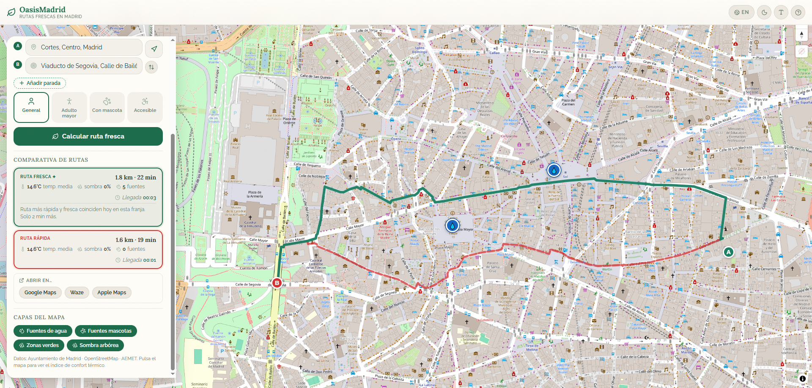

# 🌳 OasisMadrid — Navegador de confort térmico y rutas saludables

<div align="center">


**Aplicación web que combina 6 conjuntos de datos abiertos del Ayuntamiento de Madrid y 3 fuentes externas para generar rutas peatonales más frescas y saludables, y mostrar el riesgo térmico por zona en tiempo real.**

<br/>

<div align="center">
  
  
</div>

<br/>

[🎯 Qué es](#-qué-es-oasismadrid) · [📌 Características](#-características) · [🏗️ Arquitectura](#️-arquitectura) · [🛠️ Stack tecnológico](#️-stack-tecnológico) · [⚡ Instalación y puesta en marcha](#-instalación-y-puesta-en-marcha)

</div>

---

> **Nota:** Este proyecto se presenta al **II Concurso de Premios a la Reutilización de Datos Abiertos del Ayuntamiento de Madrid 2026**, en la categoría de servicios web, aplicaciones y visualizaciones.

---

## 🎯 ¿Qué es OasisMadrid?

**OasisMadrid** es una aplicación web que transforma datos abiertos municipales dispersos (meteorología en tiempo real, inventario de arbolado, fuentes de agua y zonas verdes) en un servicio de movilidad peatonal orientado a la salud pública.

La aplicación calcula qué rutas a pie ofrecen mayor cobertura de sombra arbórea, mayor acceso a fuentes operativas y menor exposición térmica, comparándolas con la ruta más rápida para que el usuario tome decisiones informadas.

**Nota sobre el uso:** OasisMadrid es una herramienta de apoyo a la decisión ciudadana. Las estimaciones térmicas y de sombra se basan en modelos de interpolación a partir de datos municipales y no sustituyen las recomendaciones oficiales de las autoridades sanitarias en episodios de calor extremo.

> [!NOTE]
> **Privacidad:** La aplicación no requiere registro, no almacena datos personales y todo el procesamiento se realiza en el servidor propio. La geolocalización es opcional y se gestiona exclusivamente en el navegador del usuario.

---

## 📌 Características

- 🌡️ **Mapa de confort térmico** — Visualización en tiempo real de la temperatura interpolada y el nivel de riesgo en cualquier punto de Madrid, actualizado cada 20 minutos con datos de las estaciones municipales.
- 🗺️ **Planificador de rutas frescas** — Comparativa visual entre la ruta más rápida y la más fresca (mayor sombra, más fuentes, menor exposición térmica) con métricas de diferencia en grados, minutos y puntos de hidratación.
- 🚶 **Paseo fresco circular** — Generación de rutas circulares por duración (sin destino fijo) que maximizan la sombra y la proximidad a fuentes. Punto de partida configurable por geolocalización o dirección manual.
- 🧭 **Explorar Madrid** — Modo libre para explorar la ciudad activando/desactivando capas de zonas verdes, fuentes (beber y mascotas) y visualizando el ranking de barrios más frescos o calurosos en tiempo real.
- 👤 **4 perfiles de usuario** — Transeúnte general, persona mayor, paseo con mascota y persona con movilidad reducida. Cada perfil ajusta los pesos del algoritmo de enrutamiento.
- 💧 **Fuentes operativas filtradas** — Solo se muestran fuentes con estado EN SERVICIO (potables y para mascotas), sincronizadas diariamente con el portal municipal.
- 🌳 **Índice de sombra arbórea** — Rejilla espacial construida a partir del inventario municipal de arbolado, consultada en tiempo real para cada tramo de la ruta.
- 🔴 **Alertas térmicas** — Banners automáticos por umbral de temperatura local para advertir sobre condiciones de calor extremo.
- 📊 **Contexto climático histórico** — Cada lectura muestra la desviación respecto a las normales climatológicas históricas de la ciudad.
- ♿ **Accesibilidad WCAG 2.1 AA** — Diseñada siguiendo las pautas WCAG 2.1 nivel AA: modo de texto grande, modo de alto contraste, navegación por teclado.
- 🎨 **UI/UX Refinada** — Visualización en paralelo de rutas coincidentes en el mapa, fondo con luminosidad adaptada y claridad en los mensajes comparativos de confort térmico.
- 🌍 **Bilingüe** — Interfaz completa en castellano e inglés con cambio instantáneo.

---

## 🏗️ Arquitectura

```
oasismadrid/
├── frontend/                       # Aplicación React + Vite
│   ├── src/
│   │   ├── components/
│   │   │   ├── MapView.tsx         # Mapa interactivo MapLibre GL JS
│   │   │   ├── BottomSheet.tsx     # Panel principal (rutas, capas, explorar)
│   │   │   ├── IntroScreen.tsx     # Pantalla de bienvenida con globo 3D
│   │   │   ├── WalkPanel.tsx       # Modo paseo fresco (circular)
│   │   │   ├── ExplorePanel.tsx    # Exploración libre del mapa
│   │   │   ├── ForecastCard.tsx    # Tarjeta meteorológica con contexto histórico
│   │   │   ├── AddressInput.tsx    # Autocompletado de direcciones (Nominatim)
│   │   │   ├── AlertBanner.tsx     # Banners de alerta térmica
│   │   │   └── HelpModal.tsx       # Panel de transparencia y metodología
│   │   ├── i18n/                   # Traducciones ES/EN
│   │   └── styles.css              # Sistema de diseño centralizado
│   └── index.html
│
├── backend/                        # API REST Node.js + Express
│   ├── src/
│   │   ├── services/
│   │   │   ├── routing.ts          # Algoritmo de ruta fresca (coste compuesto)
│   │   │   ├── treeIndex.ts        # Rejilla espacial de sombra arbórea (DS-03)
│   │   │   ├── thermalIndex.ts     # Interpolación IDW + índice de confort
│   │   │   ├── madridData.ts       # Ingesta y caché de todos los datasets
│   │   │   └── fallbackData.ts     # Datos de respaldo (resiliencia)
│   │   ├── routes/                 # Endpoints REST (/api/v1/*)
│   │   └── index.ts                # Servidor Express + cron jobs
│
├── GUIA_DE_USO.md                  # Guía de pruebas paso a paso para evaluadores
└── package.json                    # Orquestación (npm run dev)
```

---

## 🛠️ Stack tecnológico

| Tecnología | Uso |
|---|---|
| **React 18** | Interfaz de usuario y componentes |
| **Vite 5** | Entorno de desarrollo y bundler |
| **TypeScript 5** | Tipado estático en frontend y backend |
| **MapLibre GL JS** | Mapa interactivo con capas vectoriales (WebGL) |
| **Three.js** | Globo 3D animado en la pantalla de bienvenida |
| **Zustand** | Gestión de estado global ligero |
| **Node.js 20** | Servidor backend |
| **Express** | Framework HTTP para la API REST |
| **node-cron** | Trabajos calendarizados de ingesta de datos |
| **PapaParse** | Parsing de CSV para datasets municipales |
| **Lucide React** | Iconografía consistente |
| **OpenRouteService** | Motor base de enrutamiento peatonal |
| **Nominatim / OSM** | Geocodificación de direcciones y mapa base |

---

## 🌐 Conjuntos de datos reutilizados

### Datos del portal datos.madrid.es (6 conjuntos)

| # | Dataset | Frecuencia | Función |
|---|---------|-----------|--------|
| DS-01 | Datos meteorológicos en tiempo real | 20 min | Mapa de confort térmico |
| DS-02 | Estaciones meteorológicas (coordenadas) | Estática | Interpolación espacial IDW |
| DS-03 | Arbolado en parques y zonas verdes | Semestral | Índice de sombra urbana |
| DS-04 | Fuentes de agua para beber | Diaria | Puntos de hidratación (perfil general) |
| DS-05 | Fuentes de agua para mascotas | Diaria | Hidratación dual (perfil mascota) |
| DS-06 | Inventario de zonas verdes | Anual | Capa de parques + proxy de sombra |

### Fuentes externas

| Fuente | Uso |
|---|---|
| OpenRouteService | Motor de enrutamiento peatonal (hasta 3 alternativas) |
| OpenStreetMap / Nominatim | Mapa base + geocodificación de direcciones |

---

## ⚡ Instalación y puesta en marcha

### Prerrequisitos
- **Node.js** `>= 20.x`
- **npm** `>= 9.x`

### Pasos

1. **Clona el repositorio**
   ```bash
   git clone https://github.com/ariaslombardero/Oasis-Madrid.git
   cd Oasis-Madrid
   ```

2. **Instala las dependencias**
   ```bash
   npm run install:all
   ```

3. **Configura las variables de entorno**
   ```bash
   cp backend/.env.example backend/.env
   ```

4. **Inicia el servidor de desarrollo**
   ```bash
   npm run dev
   ```

La aplicación estará disponible en:
- Frontend → **http://localhost:5173**
- Backend → **http://localhost:3001**
- Health check → **http://localhost:3001/api/v1/health**

> El backend intenta descargar datos reales de **datos.madrid.es** al arrancar. Si el portal no responde, cae a un dataset de respaldo con datos municipales reales abreviados para que la demo siga funcionando.

### Claves opcionales (recomendadas)

| Variable | Para qué sirve | Cómo obtenerla |
|----------|----------------|----------------|
| `ORS_API_KEY` | Rutas peatonales reales (sin esto las rutas son línea recta) | [openrouteservice.org/dev](https://openrouteservice.org/dev/) — registro gratis (2.000 req/día) |

---

## 🌐 Endpoints del backend

```
GET  /api/v1/health              # Estado del servidor
GET  /api/v1/weather/current     # Datos meteorológicos en tiempo real
GET  /api/v1/fountains?type=     # Fuentes (drink | pet)
GET  /api/v1/greenspaces         # Zonas verdes
GET  /api/v1/thermal/point       # Índice de confort para un punto (?lat=&lng=)
GET  /api/v1/thermal/city        # Resumen térmico de la ciudad
GET  /api/v1/thermal/ranking     # Ranking de barrios por temperatura
GET  /api/v1/alerts/active       # Alertas térmicas activas
POST /api/v1/route/fresh         # Cálculo de ruta fresca
     body: { "origin": [-3.7038, 40.4168], "destination": [-3.6824, 40.4150], "profile": "general" }
```

---

## 🤖 Desarrollo asistido por IA (Vibe Coding)

Este proyecto ha sido desarrollado íntegramente mediante **AI-Driven Development**, utilizando modelos avanzados de lenguaje para la arquitectura, la lógica algorítmica y el diseño de interfaz. El flujo de trabajo ha incluido:

1. **Diseño de arquitectura React + Node.js** con separación estricta frontend/backend y API REST documentada.
2. **Algoritmo de coste compuesto** con ponderación termodinámica de rutas, incluyendo la lógica de inyección de waypoints por fuente y la función de scoring por perfil de usuario.
3. **Índice espacial de sombra arbórea** construido como rejilla en memoria para consultas de proximidad de alta velocidad sin dependencia de PostGIS.
4. **Interpolación IDW** como técnica de aprendizaje automático no paramétrico aplicada a las lecturas de estaciones meteorológicas municipales.
5. **UI/UX mobile-first** con globo 3D animado, sistema de diseño centralizado y diseño orientado a WCAG 2.1 AA.

---

## 📄 Uso

Este proyecto se presenta como candidatura al II Concurso de Premios a la Reutilización de Datos Abiertos del Ayuntamiento de Madrid 2026. Demuestra que los datos abiertos municipales son suficientes para construir un servicio de salud pública preventiva sin infraestructura propietaria.

---

## 🤝 Contribuciones

Las contribuciones son bienvenidas. Si deseas proponer mejoras en el algoritmo de enrutamiento, ampliar la cobertura de datasets o añadir nuevas funcionalidades, abre un *Issue* o envía un *Pull Request*.

---

## 📜 Licencia

Este proyecto está bajo la Licencia **MIT**. Consulta el archivo [LICENSE](./LICENSE) incluido en el repositorio para más detalles.

**Datos:** Ayuntamiento de Madrid (datos.madrid.es), OpenStreetMap (ODbL).
**Mapa base:** MapLibre GL JS · OSM Tiles.

---

## 👨‍💻 Autor

**Jose Antonio Arias Lombardero**
*Experto en Inteligencia Artificial aplicada al sector público, innovación, contratación y fondos europeos.*

Esta aplicación forma parte de un portfolio de soluciones tecnológicas conceptualizadas, desarrolladas y desplegadas en entornos cloud para su aplicación en el sector público. Mi objetivo es demostrar cómo el uso estratégico de modelos avanzados de IA (Vibe Coding) puede escalar radicalmente la digitalización, la operatividad y la alfabetización tecnológica de la Administración.

🔗 [Consulta mi portfolio completo de aplicaciones y trayectoria profesional](https://ariaslombardero.es/)
